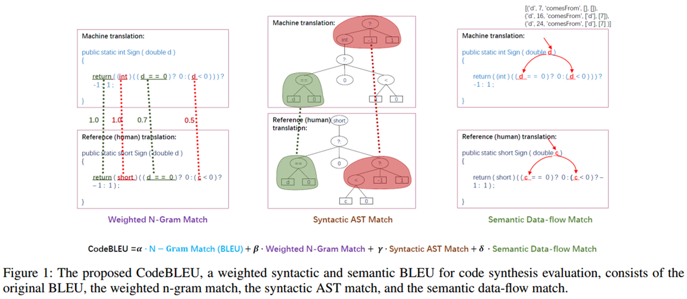

# NetConfig-Benchmark

## 数据集
### (1) 来源
#### a) 设备手册
特点：公开可获取，简单、规模较小
华为：https://support.huawei.com/hedex/hdx.do?docid=EDOC1100331626&id=ZH-CN_TASK_0172365881
思科：https://www.cisco.com/c/zh_cn/support/routers/asr-9000-series-aggregation-services-routers/products-configuration-examples-list.html
瞻博：https://www.juniper.net/documentation/cn/zh/software/junos/bgp/topics/topic-map/load-balancing-bgp-session.html
(待补充)
#### b) 培训资料、竞赛题目
华为HCIE、HCIP实验手册：

#### c) 现网配置 ❌
大部分现网配置不会公开，即使找到公开配置，也无法确定配套需求。

#### d) 大模型生成 ❓
由LLM生成组网需求与网络拓扑，配套配置参考如何生成？

### (2) 结构
#### a) Input：
组网需求：

网络拓扑：

#### b) Output：
参考配置：

TODO LIST：
需要满足1. 配置任务多样性; 2. 设备厂商多样性......
## 评测指标
### (1) 静态
#### a) 语法正确性

#### b) 抽象语法树AST
《CodeBLEU: a Method for Automatic Evaluation of Code Synthesis》：优化机器翻译指标BLEU，适用于代码生成领域，可作为配置生成评测指标参考

 《Leveraging LLM Agents for Translating Network Configurations》:配置翻译相关工作，使用如下指标：

### (2) 动态
#### a) 路由表
特点：适用于实际生产场景

#### b) 端到端需求是否实现
特点：适用于通用场景
